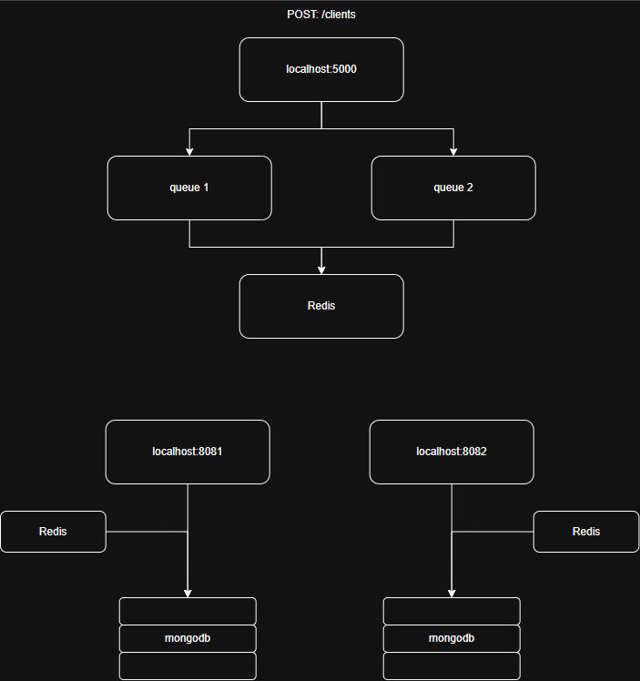

# Load Balancer 

## Sobre o projeto

Este projeto foi desenvolvido com fins de estudo, com foco em aprofundar o entendimento sobre arquiteturas de sistemas distribuídos e bancos de dados não relacionais.

A aplicação implementa um Load Balancer com gerenciamento de tarefas baseado em filas (queues), explorando na prática conceitos de distribuição de carga, processamento assíncrono e escalabilidade.

### Tecnologias utilizadas

- **TypeScript** — tipagem estática e maior robustez no desenvolvimento
- **Redis** — gerenciamento de filas e cache em memória
- **MongoDB** — persistência de dados não relacional
- **Express** — camada de servidor HTTP leve e flexível

O principal objetivo é experimentar padrões que favorecem alta performance e baixa latência na execução de tarefas concorrentes.

### Testes de Performance

| Qtd. Handler's | 1º Teste | 2º Teste | 3º Teste |
|--------------|----------|----------|----------|
| Sem Load-Balancer | 6.82 s | 6.75 s | 7.1 s |
| 2 Handler's | 6.82 s | 6.75 s | 7.1 s |
| 3 Handler's | 6.9 s | 6.72 s | 6.70 s |
| 4 Handler's | 6.62 s | 6.56 s | 6.56 s|

---
## Execution Flow



---
## Como adicionar mais Handler's ao projeto

<!--ADICIONAR NOVO CÓDIGO DEPOIS-->

- Dentro do arquivo 'src/api/controller/index.ts' alterar a váriavel 'handler_numbs' para a quantidade de handler's desejada.

``` ts
    const info:string = `${req.body.email} ${req.body.password}`;
    const handler_numbs = 4; // <-- aqui

    const HANDLE_1 = await redis.lRange("HANDLE_1", 0, -1)
```

- Após realizado, dentro da pasta 'src/handlers' criar um novo arquivo 'handler' com o seguinte código:

``` ts 
import mongo_schema from '../api/model/User.ts';

import mongodb from '../config/mongo.ts';
import redis from '../config/redis.ts';

import express from 'express';
const app: express.Express = express();
const port: number = 8080;

await redis.connect()
.then(() => console.log('redis connect'));

await mongodb()
.then(() => console.log(`mongodb connect in port ${port}`));

app.listen(port, async (): Promise<void> => { 
    while (true) {   
        let HANDLE_1: string[] | null = await redis.lRange("HANDLE_1", 0, -1) 
        
        if(HANDLE_1.length > 0){
            const user: any = await redis.lmPop( 
                'HANDLE_1',
                'RIGHT',
            ); 
    
            const user_split: string[] = user[1][0]?.split(' ');
            let user_email: any = user_split[0];
            let user_password: any = user_split[1];
    
            await mongo_schema.create({ 
                email: user_email,
                password: user_password
            });
             // console.log(user_split) // para visualizar a execução do handler
        } else {
            continue;
        }
    }
});
```
- Não esqueça de alterar ```  const port: number = 8080; ``` para uma porta não utilizada e ```const handler_name: string = "HANDLE_1" ``` para uma váriavel nao utilizada anteriormente.
---
## Executando o Projeto
 
1. Realizar o clone desse repositório:
```bash
    git clone https://github.com/victorfreire7/job-queue-system.git
```

2. Preencher as variáveis de ambiente:
``` ts
    MONGO_CONNECTIONSTRING=
    MONGO_URI=
    MONGO_USER=
    REDIS_USER=
    REDIS_PASSWORD=
```

3. Executar o server da API:
``` bash
    node src/api/server.ts
```

4. Executar todos os handler's criado:
```bash
    node src/handler/handler.one.ts
    node src/handler/handler.two.ts
    [...]
```

5. A aplicação ficará ativa em [```127.0.0.1:5000```](http://127.0.0.1:5000).
---
## File Tree

```
    redis-connect/
    ├─ src/
    │  ├─ api/
    │  │  ├─ controller/
    │  │  │  └─ index.ts
    │  │  ├─ model/
    │  │  │  └─ User.ts
    │  │  └─ server.ts
    │  ├─ config/
    │  │  ├─ mongo.ts
    │  │  └─ redis.ts
    │  └─ handler/
    │     ├─ handler.one.ts
    │     └─ handler.two.ts
    ├─ .env
    ├─ .env.example
    ├─ .gitignore
    ├─ package-lock.json
    ├─ package.json
    ├─ README.md
    └─ tsconfig.json
```
---
## Dependências e Dependências de Desenvolvedor

```json
    "devDependencies": {
        "@types/express": "^5.0.6",
        "typescript": "^6.0.3"
    },
    "dependencies": {
        "dotenv": "^17.4.2",
        "express": "^5.2.1",
        "mongodb": "^7.2.0",
        "mongoose": "^9.5.0",
        "redis": "^5.12.1"
    }
```